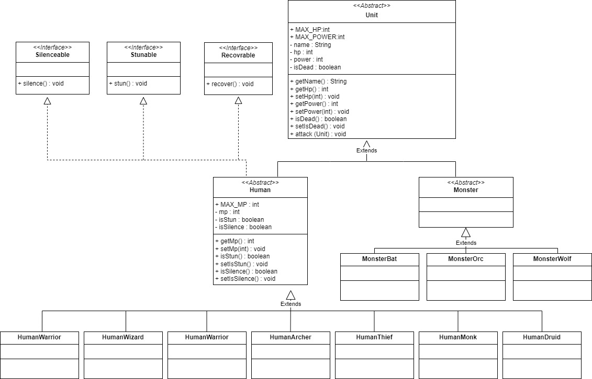
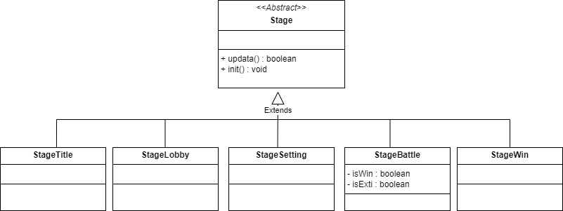

# 다형성 랜덤 디펜스게임
> 소개
> 
  괴물에게 납치된 공주를 구하기 위해서 떠나는 용사들.. 공주를 구하러 가는길엔 다양한 몬스터들이 기다리고 있는데.. 강한 몬스터들을 상대하기 위하여 강한 길드원을 고용하며 싸워보자.

> 게임에 대한 컨셉 
* 게임의 컨셉
  * 총 5단계로 구성되어 있는 랜덤 몬스터 디펜스로 랜덤으로 몬스터들이 리스폰된다.
  * 골드를 사용하여 영웅들을 뽑을 수 있다. 뽑은 영웅들을 사용하여 파티를 구성하여 몬스터를 무찌르러 떠난다.

> 스테이지

 ⚜️길드⚜️ 
   * 길드원은 5000골드를 사용하여 랜덤확률을 통한 뽑기가 가능한다. 

 💼인벤토리💼 
   * 인벤토리에서는 아이템 착용 및 판매가 가능하다. 
   * 아이템 착용시 
   * 아이템 판매 시 구매가격의 절반 가격으로 판매한다.  

  🛒상점🛒 
   * 상점에서는 아이템을 구매 가능하다. 
   * 헬멧, 방어구, 반지 아이템을 보유한 골드 이내에서만 구매가 가능하다. 
 

 ⚔️배틀필드⚔️ 
   * 배틀필드에서는 구성한 파티원으로 다양한 몬스터들과 싸운다. 
   * 전투시에 플레이어중 한명이라도 HP가 0 이 되면 전투가 종료된다. 
   * 적 몬스터를 모두 처치시 전투가 종료된다. 

> 플레이 설명

* 플레이 설명
  * 조작 방법
    * 각 상황에 맞는 버튼을 누르면 게임이 진행된다.
    * 종료하기를 선택하면 즉시 게임이 종료된다.
    * 어택을 누르면 몬스터를 기본 공격한다.
    * 스킬을 누르면 마나를 사용하여 몬스터에게 스킬을 사용한다.

  * 전투모드
    * 몬스터와의 전투중에는 어택과 스킬을 사용 할 수 있다.
    * 어택을 사용하면 기본공격으로이 나가게 된다.
    * 스킬을 사용하면 각자의 스킬로 몬스터를 공격한다.
    * 몬스터를 죽이면 전투에서 승리하고 전투가 종료된다.

  * 종료 조건
    * 종료하기를 누르면 즉시 게임이 종료된다.
    * 용사들 체력이 0이 되면 즉시 게임이 종료된다.
    * 모든 몬스터 처치하고 마지막 지점 (5단계)에 도달하면 게임 승리와 동시에 종료된다.

> 캐릭터 설명

💪전사 
  * 1000의 체력, 200의 마나, 최대 80의 파워를 가지고 있다. 
  * 기본캐릭터 
 ⚡법사 
  * 500의 체력, 600의 마나, 최대 60의 파워를 가지고 있다. 
  * 기본캐릭터 
 🧙힐러 
  * 400의 체력, 700의 마나, 최대 50의 파워를 가지고 잇다. 
  * 기본캐릭터 
 🎯궁수 
  * 700의 체력, 400의 마나, 최대 50의 파워를 가지고 있다. 
  * 가챠확률 40% 
 👥도적 
  * 600의 체력,  300의 마나 최대 70의 파워를 가지고 있다. 
  * 가챠확률 40% 
 🥋뭉크 
  * 800의 체력, 800의 마나 , 최대 100의 파워를 가지고 있다. 
  * 가챠확률 10% 
 🧙‍♀️드루이드 
  * 600의 체력, 1000의 마나, 최대 150의 파워를 가지고 있다. 
  * 가챠확률 10% 

   ⚠️몬스터⚠️  
      🦇 박쥐 
     * 100의 체력, 최대 30의 파워를 가지고 있다. 
     * 침묵을 사용하여 침묵효과를 준다. 
       🧟‍♂️오크 
     * 150의 체력, 최대 60의 파워를 가지고 있다. 
     * 스턴을 사용하여 일정확률로 스턴효과를 준다. 
      :wolf: 늑대 
     * 200의 체력, 최대 10의 파워를 가지고 있다. 
     * 전체 공격을 사용하여 적 모두에게 데미지를 입힌다. 

* 스킬 설명
  🦸‍♂️용사🦸‍♀️ 
       💪전사 
     * 마나 20을 소모하여 두배의 데미지를 가한다. 
     * 가한 데미지의 절반만큼 체력을 회복한다.  
       ⚡법사 
     * 마나 40을 소모하여 적 전체에게 전기마법을 가한다.  
       🎯궁수 
     * 마나 40을 사용하여 더블샷 공격을 가한다.  
       👥도적 
     * 마나 20을 사용하여 더블스탭공격을 가한다.  
       🧙힐러 
     *  마나 50을 소모하여 아군의 체력을 50이 회복시킨다.  
       🥋뭉크 
     * 마나 40을 사용하여 정권찌르기를 두번 가한다. 가한데미지의 절반은 회복한다.  
       🧙‍♀️드루이드 
     * 마나 40을 사용하여 적 전체에게 동물을 소환하여 공격을 가한다.    

> Class Diagram
* Unit

* Stage

> Demo

# polyGame
